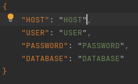
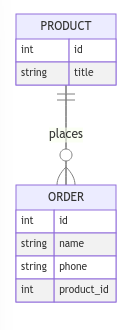
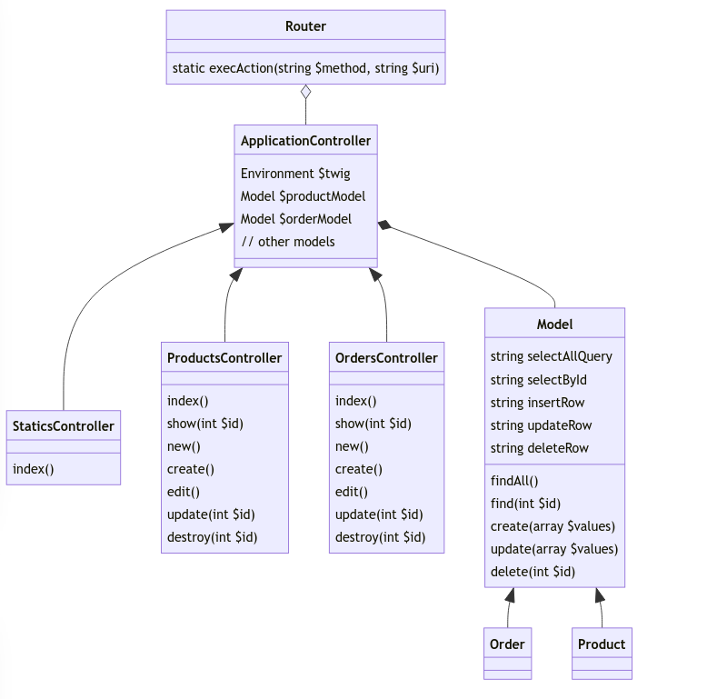

# Приложение для собеседоания
## Запуск
Сначала необходимо создать базу данных
```
CREATE DATABASE db_name;
```
Затем в файле .env необходимо указать данные о подключении:
<div style="display: flex; justify-content: center;">



</div>

## Описание

Выполненное приложение представляет собой небольшой сайт, на котором создано несколько страниц. 
Главная страница с общим описанием сайта, и две страницы, реализующие CRUD для работы с ресурсами (Продукты и Заказы)
### Сущности
Ресурсы связаны следующим образом:
<div style="display: flex; justify-content: center;">



</div>

### Архитектура
В приложении реализован прототип MVC-архитектуры и используется RESPful API (единственное отличие - для метода update применяется не PUT, а POST запрос).

Структура классов следующая:
<div style="display: flex; justify-content: center;">



</div>

### Дизайн
В дизайне используется bootstrap v4